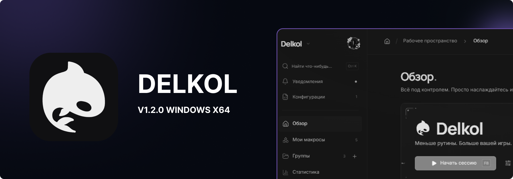
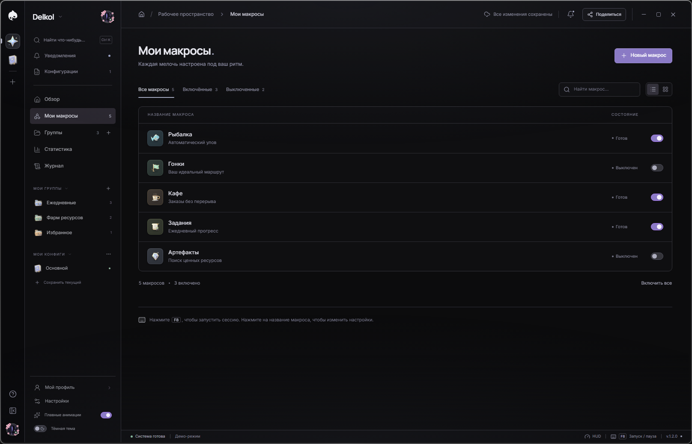
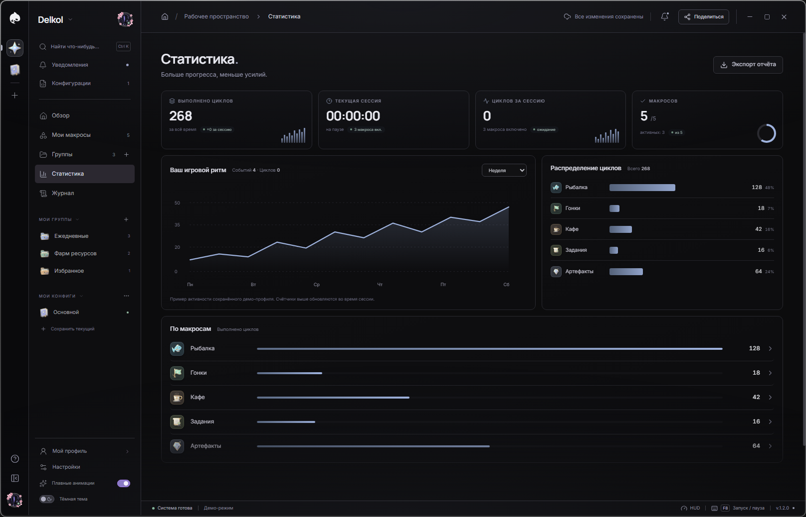
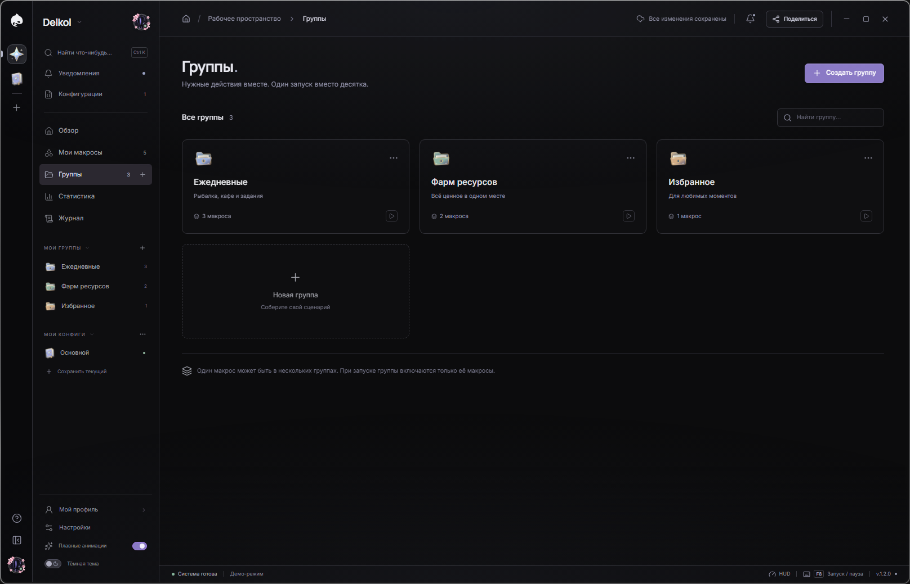
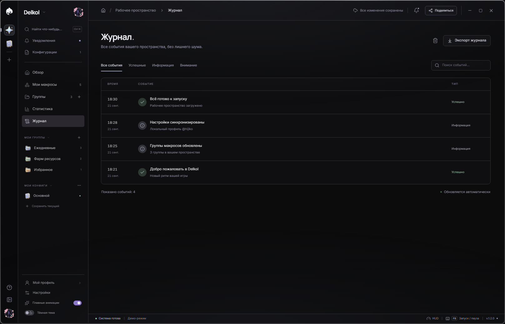
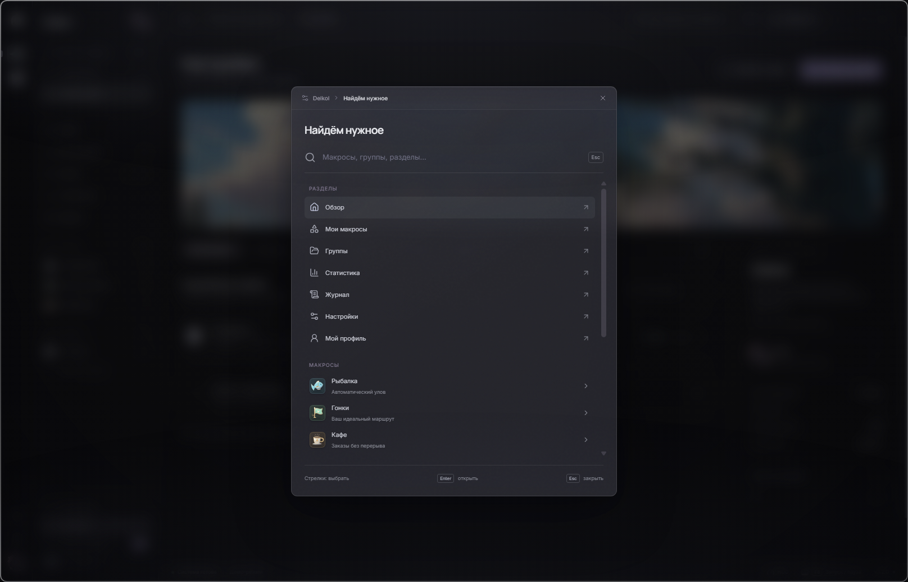
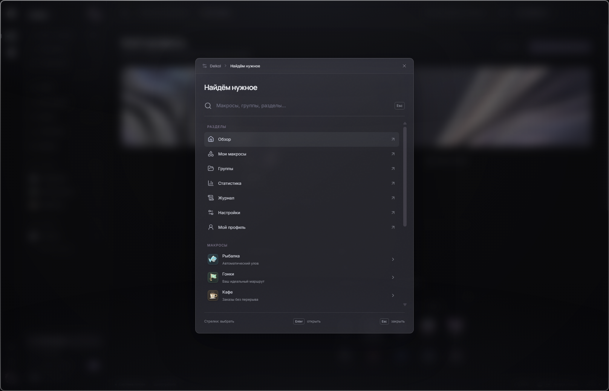
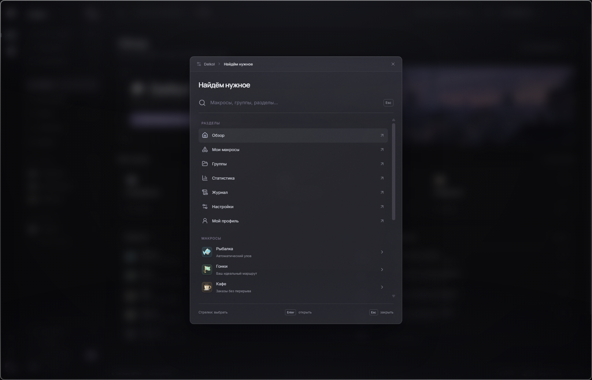
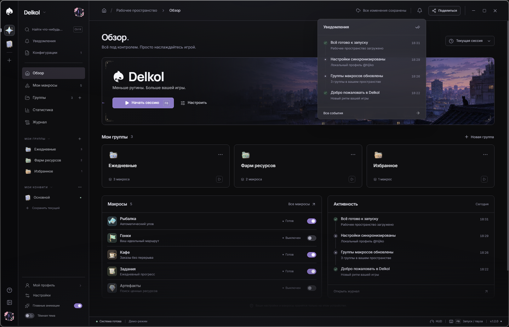

<div align="center">
  
</div>

<div align="center">


**[⬇️ Скачать](#-готовые-сборки)** · **[📸 Скриншоты](#-скриншоты)** · **[🛠 Собрать самому](#-сборка-из-исходников)** · **[☁️ База данных](docs/SUPABASE_SETUP.md)**

</div>

---

## ✨ Что такое Delkol

**Delkol** — настольное приложение для Windows, в котором живут ваши игровые макросы: собирайте их в группы,
настраивайте сценарии, следите за статистикой и держите всё под рукой в одном спокойном, аккуратном интерфейсе.

Это не «ещё одна утилита с галочками», а полноценное рабочее пространство: свой оконный фрейм вместо системного,
тёмная и светлая темы, командная палитра на `Ctrl + K`, плавающая HUD-пилюля у края экрана, уведомления,
профиль с аватарами и рамочками, облачная синхронизация и оптимизатор системы — в одном приложении на Electron + React.

> 🎯 **Демо-режим.** Макросы выполняются на **симулированной модели игры** (движок-порт с четырьмя состояниями,
> мини-игра с «характером» рыбы и watchdog-таймаутами). Приложение намеренно не подключается к игре и ничего
> не отправляет в неё — это интерактивная демонстрация интерфейса и логики.

---

## 🚀 Возможности

<table>
<tr><td width="50%" valign="top">

**🕹️ Макросы и движок**
- 5 типов макросов: Рыбалка, Гонки, Кафе, Задания, Артефакты
- Редактор макросов в трёх вкладках: параметры, выполнение, безопасность
- Циклы, задержки, повторы, задержка старта, паузы «перерыв каждые N минут»
- Фазы выполнения и человекочитаемые детали каждого цикла
- Авто-стоп при ошибке, лимит повторов, порог уверенности, `pauseWhenHidden`
- Горячая клавиша запуска/паузы: `F6`, `F8` или `F9` (по умолчанию `F8`)

**🗂️ Организация**
- Группы макросов с цветами и описаниями
- Конфигурации: сохранение, переименование, импорт и экспорт в JSON
- Резервные копии конфигов и мгновенное переключение

**📊 Аналитика**
- Статистика по циклам и сессиям с графиками
- Журнал событий с типами (успех / инфо / предупреждение)
- Таймер сессии и статус-бар с живым индикатором

</td><td width="50%" valign="top">

**🎨 Интерфейс**
- Собственный оконный фрейм (без системного заголовка) и плавные анимации
- Тёмная и светлая темы с радиальным переходом
- Командная палитра `Ctrl + K`: разделы, макросы, группы, конфиги
- Сворачиваемый сайдбар, компактный режим, режим фокуса
- HUD-пилюля у края экрана: всегда сверху, не крадёт фокус
- Уведомления приложения и системные всплывашки

**👤 Профиль и сообщество**
- Аватар, рамки (магазин рамок), обложка профиля, подписчики и просмотры
- «Топ конфиги»: делитесь сборками и скачивайте чужие
- Соц-слой на Supabase: лайки, загрузки, просмотры, покупки рамок

**☁️ Данные**
- Регистрация и вход по e-mail, восстановление пароля
- Облачная синхронизация рабочего пространства (RLS-политики в `supabase/schema.sql`)
- Гостевой режим и офлайн-работа: локальные данные в `localStorage`
- Свои шрифты (Inter, Manrope) — интерфейс не зависит от сети

**🧹 Оптимизатор системы**
- Информация о ПК, поиск больших файлов, очистка временных файлов и игрового кэша
- Прогресс с детализацией по шагам; всё, кроме двух чисток, работает в режиме «только чтение»

</td></tr>
</table>

---

## 📥 Готовые сборки

В папке [`builds`](builds) лежат три варианта одного и того же приложения версии **1.2.0** (Windows x64):

| Вариант | Где лежит | Что это | Размер |
|---|---|---|---|
| 🪟 **Папка (без установки)** | [`builds/win`](builds/win) | Готовая папка с `Delkol.exe` и всеми библиотеками — распакуйте и запускайте | ~395 МБ |
| 🎒 **Portable** | [`builds/Portable`](builds/Portable) | Один `Delkol-Portable-1.2.0.exe`: ничего не устанавливает, настройки можно носить с собой | ~115 МБ |
| 📦 **Установщик** | [`builds/Установщик`](builds/Установщик) | `Delkol-Setup-1.2.0.exe`: обычная установка в систему, ярлыки на рабочем столе и в меню «Пуск» | ~115 МБ |

**Какой выбрать?**

- **Portable** — быстрее всего: скачал один файл, запустил, играешь. Ничего не остаётся в системе, кроме ваших настроек.
- **Установщик** — если хочется ярлыки, автозапуск и удаление через «Программы и компоненты», плюс возможность
  выбрать папку установки.
- **Папка (`builds/win`)** — для тех, кто кладёт приложение на флешку, сетевую папку или хочет видеть все файлы рядом.

**Системные требования:** Windows 10 или 11 (x64), ~2 ГБ ОЗУ, ~400 МБ свободного места, интернет нужен только
для облачной синхронизации и сообщества — остальное работает офлайн.

> ⚠️ **Windows SmartScreen.** Сборки не подписаны сертификатом, поэтому при первом запуске система может показать
> «Windows защитила ваш компьютер». Нажмите **Подробнее → Выполнить в любом случае** — это ожидаемое поведение
> для неподписанных приложений.


---

## 📸 Скриншоты

Главный экран — обзор рабочего пространства, живая сессия и панель активности:


<table>
<tr>
<td width="50%"><br><sub><b>Мои макросы</b> — таблица макросов, прогресс и быстрые действия</sub></td>
<td width="50%"><br><sub><b>Статистика</b> — циклы, сессии и графики по дням</sub></td>
</tr>
<tr>
<td width="50%"><br><sub><b>Группы</b> — макросы, собранные по смыслу и цветам</sub></td>
<td width="50%"><br><sub><b>Журнал</b> — каждое событие с типом и временем</sub></td>
</tr>
<tr>
<td width="50%"><br><sub><b>Настройки</b> — профиль, темы, уведомления, оптимизация</sub></td>
<td width="50%"><br><sub><b>Профиль</b> — аватар, рамка, обложка, подписчики</sub></td>
</tr>
<tr>
<td width="50%"><br><sub><b>Ctrl + K</b> — одна палитра для разделов, макросов, групп и конфигов</sub></td>
<td width="50%"><br><sub><b>Уведомления</b> — что произошло, пока вы играли</sub></td>
</tr>
</table>

---

## 🧰 Технологии

| Слой | Технологии |
|---|---|
| Оболочка | **Electron 38** (окна загрузки, входа, рабочего пространства и HUD + всплывашки уведомлений), `contextIsolation`, свой preload-мост |
| Интерфейс | **React 19**, **TypeScript 5.9**, **Tailwind CSS 4**, **Motion**, **lucide-react** |
| Сборка | **Vite 7** + `vite-plugin-singlefile` — весь интерфейс собирается в один `index.html`, который работает офлайн |
| Данные | `localStorage` (локальный первый слой) + **Supabase** (аккаунты, синхронизация воркспейса, соц-слой, RLS) |
| Дистрибутив | **electron-builder 26** — NSIS-установщик, portable-сборка и распакованная папка |
| Шрифты | Свои Inter и Manrope (`src/fonts`) — без внешних запросов |


### 📌 Полезные команды

| Команда | Что делает |
|---|---|
| `npm run dev` | Vite-сервер разработки интерфейса (`http://localhost:5183`) |
| `npm run dev:full` | Vite + Electron: живая разработка настоящего окна приложения |
| `npm run dev:electron` | Собирает веб-бандл и запускает Electron как в продакшене |
| `npm run build:web` | Только интерфейс → `dist-web/index.html` (один файл) |
| `npm run build:exe` | Только дистрибутивы → `release/` (NSIS + portable) |
| `npm run test:engine` | Тесты движка макросов (симуляция цикла) |
| `npx electron scripts/capture-screenshots.cjs` | Переснять все скриншоты интерфейса для README и документации |

---

## 📁 Структура проекта

```
Delkol/
├── src/                     # исходный код интерфейса (React + TypeScript)
│   ├── App.tsx              # рабочее пространство: страницы, сессии, диалоги
│   ├── components/          # Sidebar, макросы, группы, статистика, профиль, HUD…
│   ├── macros/              # движок макросов: engine, runtime, automation
│   ├── lib/                 # Supabase: авторизация, синхронизация, соц-слой
│   ├── styles/              # CSS: темы, стекло, воркспейс, попапы
│   └── fonts/               # свои шрифты Inter / Manrope
├── electron/                # главный процесс: окна, IPC, уведомления, прелоад
├── scripts/                 # сборка скриншотов, сеятель сообщества, смоук-тесты
├── supabase/schema.sql      # таблицы, функции и RLS-политики облака
├── public/                  # арт, аватары, логотип, favicon
├── build/                   # иконки приложения (icon.ico, icon.png)
├── docs/                    # SUPABASE_SETUP.md, баннер и скриншоты
├── builds/                  # готовые сборки: win / Portable / Установщик
├── index.html               # точка входа однофайлового бандла
└── electron-builder.yml     # конфигурация дистрибутивов
```

---

## ❓ Вопросы и ответы

<details>
<summary><b>Макрос залезет в игру и будет кликать за меня?</b></summary>

Нет. Версия 1.2.0 — это рабочее пространство и демонстрация: движок считает макросы на симулированной модели игры
и показывает понятные детали каждого цикла. Никакого захвата экрана и эмуляции ввода здесь нет.
</details>

<details>
<summary><b>Почему сборки весят больше 100 МБ?</b></summary>

Внутри — Chromium и Node.js (то есть весь Electron). Такова цена настольного приложения на веб-технологиях;
плюс наш `Delkol.exe` (~201 МБ) содержит упакованный интерфейс.
</details>

<details>
<summary><b>Есть ли версии для macOS и Linux?</b></summary>

Пока нет: сборка настроена только под Windows (`nsis` и `portable`). Код кроссплатформенный,
поэтому добавить другие платформы в `electron-builder.yml` несложно — нужны только публикация и тесты.
</details>

<details>
<summary><b>Где хранятся мои настройки?</b></summary>

Локально — в `localStorage` приложения (профиль, макросы, группы, конфиги), а при входе в аккаунт —
в таблице `workspaces` вашего проекта Supabase. Конфиги можно экспортировать в JSON и переносить вручную.
</details>

<details>
<summary><b>Почему антивирус или SmartScreen ругается?</b></summary>

Приложение не подписано сертификатом подписи кода. Проверить можно на <a href="https://www.virustotal.com">VirusTotal</a>,
а в будущем сюда добавится подпись и автообновление через `electron-updater`.
</details>

---

## 🗺️ Планы

- [ ] Настоящий backend: захват экрана, детекция по пикселям и человекообразный ввод (порт neverfish)
- [ ] Подпись кода и автообновления через `electron-updater`
- [ ] Сборки для macOS и Linux, вариант для ARM64
- [ ] Экспорт статистики в CSV и Markdown-отчёты о сессиях
- [ ] Больше типов макросов и общие группы с друзьями

---

## 📄 Лицензия

© 2026 **Delkol**. Все права защищены.


<div align="center">
<sub>Delkol 1.2.0</sub>
</div>
